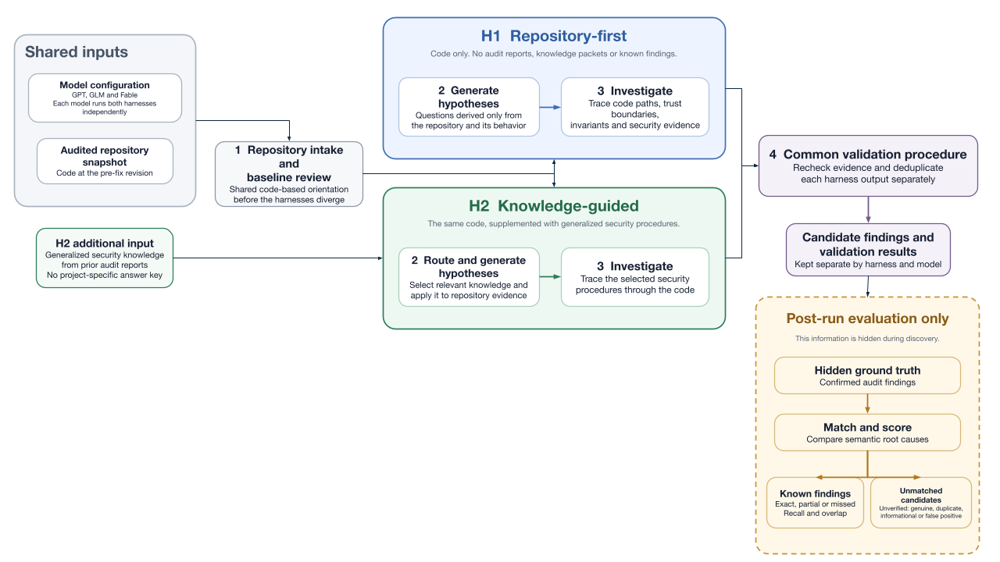
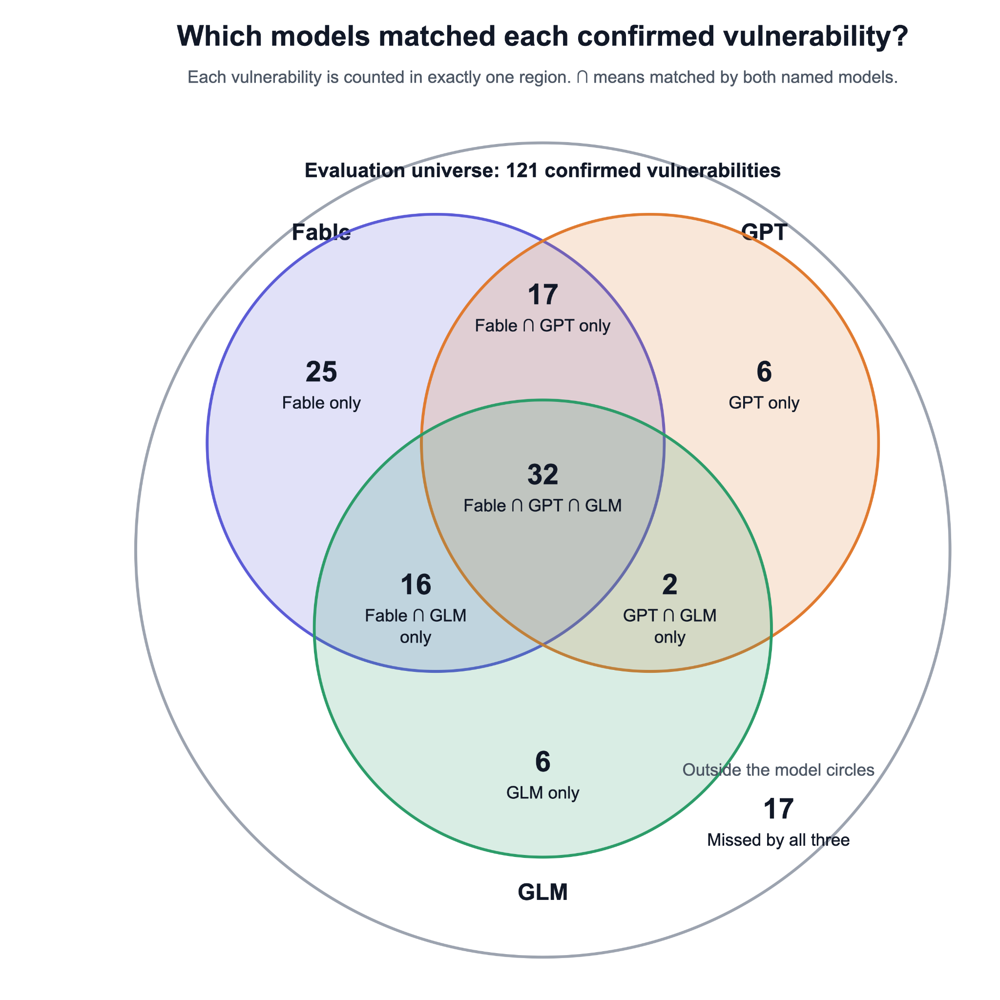
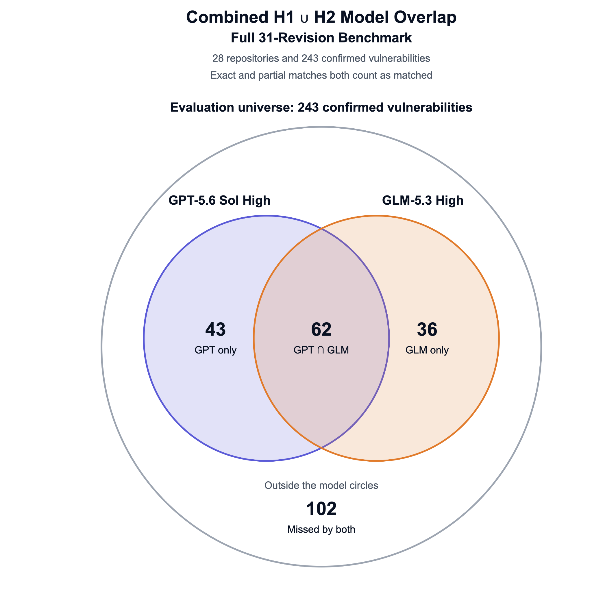

# Scout for Soroban: Static Detectors and AI-Based Security Analysis

*2026-Q2 Results Report — v1.0*

**Contents**

- [Executive Summary](#executive-summary)
  - [Out-of-scope Experiment](#out-of-scope-experiment)
- [Deliverables and Evaluation Results](#deliverables-and-evaluation-results)
  - [New Soroban Static Analysis Detectors](#new-soroban-static-analysis-detectors)
  - [AI-Based Security Analysis Proof of Concept: First Iteration](#ai-based-security-analysis-proof-of-concept-first-iteration)
  - [AI-Based Security Analysis Proof of Concept: Second Iteration](#ai-based-security-analysis-proof-of-concept-second-iteration)
- [Conclusions and Roadmap](#conclusions-and-roadmap)

# Executive Summary

This work delivers an updated release of Scout’s Soroban static analysis and a proof of concept for AI-based security analysis with two harnesses. They are available at [Scout Audit](https://github.com/CoinFabrik/scout-audit) and [Soroban Audit Harness](https://github.com/CoinFabrik/soroban-audit-harness), respectively.

The Scout Audit release integrates three new detectors and supports Soroban SDK 28. Release validation also uncovered and fixed a pre-existing cycle-handling problem in two event detectors, and we strengthened Scout’s toolchain selection, error reporting, and CI test coverage. The complete detector matrix passed, with more than 100 successful checks across Ubuntu and macOS.

For the AI-based analysis, we built two complementary harnesses, H1 and H2, and ran three selected models independently against audited Soroban repositories, at the revisions that predate the fixes reported in their security audits.

H1 performed a repository-first review using only the source code, generating and investigating hypotheses from the contract’s structure and behavior. It relied entirely on the models’ own auditing ability. H2 analyzed the same code with the support of five generalized security-investigation packets distilled from 797 normalized audit findings, without receiving the evaluated project’s report or known vulnerabilities. After both harnesses had run, we compared their findings with the hidden confirmed vulnerabilities and classified each match.

On the full benchmark of 31 audited revisions, GPT-5.6 Sol High reached a weighted recall of 38.27% and GLM-5.3 High reached 30.86%. On a common subset of 12 projects, Claude Fable 5.1 High reached 65.70%, against 42.98% for GPT and 35.54% for GLM.

As an out-of-scope experiment, we also tested an exploit-oriented workflow based on Niels Provos’s [IronCurtain](https://github.com/provos/ironcurtain) harness. The exercise was time-consuming and depended on several prerequisites and assumptions, including a reproducible build environment, reachable contract states, an attacker model, testable success conditions, and suitable supporting tools. It was not run systematically against the audited revisions and therefore cannot be compared directly with the H1 and H2 results. Even so, it showed that going from a candidate finding to a reproducible exploit is a separate stage, and a much more open-ended one. That matters for smart contracts, where a confirmed issue can put deployed assets or protocol operations at risk, so candidate findings should stay private until they have been validated and disclosed responsibly.

The H1 and H2 architecture is shown below:

The proof of concept is already operational and can be used by security professionals to analyze Soroban repositories. It accepts repository-level source code, executes two complementary analysis harnesses with different language models, and produces structured vulnerability hypotheses for professional review.

## Out-of-scope Experiment

A possible next step is to extend the workflow from vulnerability discovery to exploit construction and validation. H1 and H2 have reasonably predictable per-repository costs because their stages and model calls are bounded. Exploit development is less predictable: each candidate may require custom tests, transaction and state setup, repeated model runs, expert review, and experimentation with fuzzers, symbolic execution, debuggers, local networks, and other specialized tools. Nobody can tell in advance which tools, or how many iterations, a given candidate will need, and adding tools does not guarantee a working exploit.

# Deliverables and Evaluation Results

## New Soroban Static Analysis Detectors

This phase focused on three objectives: (1) completing the integration of three new Soroban detectors into [Scout](https://github.com/CoinFabrik/scout-audit); (2) completing their documentation and test coverage; and (3) publishing an updated Scout release containing the new detectors and test cases. Scout also had to be updated for the current Soroban SDK so that the released detectors could analyze current Soroban projects.

The first milestone was completed with the integration and release of three new Soroban security detectors in Scout: delegated-spending-from-auth, init-instead-of-constructor, and infinite-recursion-over-storage. Although the detectors had already been accepted into Scout’s development branch, they were not yet part of an official release. This work brought them into an official release and completed their documentation, which covers detection logic, examples, and remediation guidance. The vulnerable and remediated test cases are now part of Scout’s test suite.

Scout was also updated to support Soroban SDK 28 and the corresponding Rust toolchain. During testing, we identified and fixed a pre-existing cycle-handling problem in two existing event-related detectors. The final release passed all 103 CI checks, including the Soroban detector tests, release packaging, and publication checks. Scout 0.3.17 was then published through the official repository, crates.io, Docker Hub, and the project documentation site.

During the same period, [Mihai Eremia/XOXNO](https://github.com/mihaieremia/scout-audit) published an independent Soroban-focused fork of Scout. That work was not incorporated into this release, but it provided a useful external reference, particularly for GitHub Actions integration, false-positive reduction, additional detectors, and more precise test assertions. The two took different approaches. The fork aimed at a streamlined Soroban developer experience; our work made sure the three detectors committed under this milestone were documented, tested with Soroban SDK 28, and shipped in an official Scout release.

## AI-Based Security Analysis Proof of Concept: First Iteration

The original scout-agent proof of concept focused on four types of vulnerabilities in Stellar Soroban smart contracts. It used simplified code summaries and several specialist agents because the models available at the time struggled to keep track of relevant details across large software projects. During 2026 the AI ecosystem moved quickly. Models became more capable, context windows grew, code-exploration tools improved, and a growing community produced research, experiments, and reusable techniques for AI-assisted software and security review.

Instead of modifying the original system, we built a new proof of concept for repeatable testing across different Soroban projects and a wider range of security issues. We collected 58 professional audit reports[^1] containing 797 findings and recovered the corresponding project versions from before the reported issues were fixed. These known findings were hidden from the AI agents during analysis and used afterward as an answer key for evaluating their results.

The new system compares two ways of generating vulnerability hypotheses, meaning possible security problems that still need confirmation. H1 gives the AI auditor the project code and asks it to develop its own security checklist from what it finds. H2 follows the same process but also provides relevant specialist checklists covering topics such as permissions, financial calculations, state changes, and interactions between contracts. Both approaches include a separate review stage that checks whether each hypothesis is supported by the source code.

Allbridge, Blend Capital, and Reflector were selected as the first pilot projects. Iteration 1 delivered the H1 and H2 testing system, the audit dataset, and the evaluation method required for the broader experiments in Iteration 2. Matching a hypothesis with a hidden audit finding shows that the system rediscovered a previously confirmed issue, while new findings still require review by a security professional or targeted testing.

## AI-Based Security Analysis Proof of Concept: Second Iteration

Iteration 2 expanded the evaluation to 31 audited code revisions from 28 repositories, covering 243 vulnerabilities previously confirmed by professional auditors. Each revision was analyzed using two complementary hypothesis-generation harnesses. H1 asked the model to map the repository and develop security hypotheses from the code itself. H2 followed the same repository-wide approach but supplemented it with curated security knowledge generalized from previous audit findings, without revealing the project-specific vulnerabilities being used for evaluation. The confirmed audit findings remained hidden from the models and were used afterward as ground truth. For each model, the reported results combine H1 and H2 and retain the stronger match for each known vulnerability.

### Combined H1 ∪ H2 Results on the Common 12-Project Subset

The three evaluated configurations were GPT-5.6 Sol with high reasoning in Codex, GLM-5.3 with high reasoning through OpenRouter, and Anthropic Claude Fable 5.1 with high reasoning through OpenRouter. GPT-5.6 Sol High and GLM-5.3 High completed the full benchmark, achieving weighted recall of 38.27% and 30.86%, respectively. Claude Fable 5.1 High was evaluated on a common subset of 12 projects containing 121 confirmed vulnerabilities. On that same subset, weighted recall was 65.70% for Fable, 42.98% for GPT, and 35.54% for GLM. Weighted recall gives full credit to an exact match and half credit to a partial match.

| **Evaluation scope**     | **Known vulnerabilities** | **Model configuration** | **Exact matches** | **Partial matches** | **Matched at least partially** | **Weighted recall** | **Unmatched candidate records** |
|--------------------------|---------------------------|-------------------------|-------------------|---------------------|--------------------------------|---------------------|---------------------------------|
| Common 12-project subset | 121                       | Claude Fable 5.1 High   | 69                | 21                  | 90                             | 65.70%              | 186                             |
| Common 12-project subset | 121                       | GPT-5.6 Sol High        | 47                | 10                  | 57                             | 42.98%              | 101                             |
| Common 12-project subset | 121                       | GLM-5.3 High            | 30                | 26                  | 56                             | 35.54%              | 95                              |

The models did not always match the same vulnerabilities. The following diagram divides the 121 confirmed vulnerabilities in the common subset into separate groups according to which models matched them at least partially. Each vulnerability is counted in exactly one region.

The diagram shows that 32 vulnerabilities were matched by all three models. Fable alone matched 25, while GPT and GLM alone matched 6 each. A further 17 were matched by Fable and GPT only, 16 by Fable and GLM only, and 2 by GPT and GLM only. In total, at least one model matched 104 of the 121 confirmed vulnerabilities, while 17 were missed by all three.

These results suggest that combining models gives broader coverage than any single model. They also show the limits of the approach: every model missed some known vulnerabilities, and many matches were only partial. The proof of concept is meant to support professional security review, not to replace it.

The iteration also added support for multiple model providers, separate results for each configuration, resumable execution, structured output checks, and automatic comparison reports. The unmatched candidate records in the table are leads, not confirmed vulnerabilities (see "Supporting Data and Unverified Findings" below). Deduplicating and independently testing them is one of the main steps towards a beta-ready product.

### Combined H1 ∪ H2 Results: GPT and GLM on the Full 31-Revision Benchmark

The full benchmark covered 31 audited code revisions from 28 Soroban repositories, containing 243 confirmed vulnerabilities. GPT-5.6 Sol High and GLM-5.3 High completed both H1 and H2 for the complete benchmark. Using the same union method described above, the strongest H1 or H2 result was retained for each confirmed vulnerability. Claude Fable 5.1 High is not included in this subsection because it was evaluated only on the common 12-project subset.

| **Evaluation scope**                                | **Known vulnerabilities** | **Model configuration** | **Exact matches** | **Partial matches** | **Matched at least partially** | **Weighted recall** | **Unmatched candidate records** |
|-----------------------------------------------------|---------------------------|-------------------------|-------------------|---------------------|--------------------------------|---------------------|---------------------------------|
| Full benchmark: 31 revisions across 28 repositories | 243                       | GPT-5.6 Sol High        | 81                | 24                  | 105                            | 38.27%              | 300                             |
| Full benchmark: 31 revisions across 28 repositories | 243                       | GLM-5.3 High            | 52                | 46                  | 98                             | 30.86%              | 252                             |

### H1 and H2: Different Assumptions, Complementary Coverage

The combined H1 ∪ H2 results above show the best coverage obtained when both harnesses are used, but not how each harness contributes to it. H1 asks the model to develop vulnerability hypotheses from the repository itself, while H2 analyzes the same code with additional curated, generalized security knowledge. The project-specific confirmed vulnerabilities are hidden from both harnesses. The following table compares their individual and overlapping results.

| **Evaluation scope**       | **Model** | **H1 only** | **H2 only** | **Matched by both** | **Missed by both** | **Combined H1 ∪ H2 coverage** |
|----------------------------|-----------|-------------|-------------|---------------------|--------------------|-------------------------------|
| Full 31-revision benchmark | GPT       | 19          | 16          | 70                  | 138                | 105 of 243                    |
| Full 31-revision benchmark | GLM       | 28          | 22          | 48                  | 145                | 98 of 243                     |
| Common 12-project subset   | GPT       | 7           | 11          | 39                  | 64                 | 57 of 121                     |
| Common 12-project subset   | GLM       | 16          | 13          | 27                  | 65                 | 56 of 121                     |
| Common 12-project subset   | Fable     | 14          | 13          | 63                  | 31                 | 90 of 121                     |

### Supporting Data and Unverified Findings

The issue-level data used for the tables and diagrams are available at the [Supporting Dataset Spreadsheet](https://docs.google.com/spreadsheets/d/1ayqInce49fbBtW-j2eGWaYWLY6E5WeBW/edit?gid=158949213#gid=158949213). It lists each confirmed vulnerability, its repository and audited revision, severity, model and harness configuration, match classification, and the information needed to reconstruct the results.

The report includes aggregate counts of unmatched candidate findings, but not their details. These candidates remain unverified and may be genuine issues, duplicates, informational observations, or false positives. Their records have been preserved privately for professional review and, where appropriate, responsible disclosure before publication.

### Comparison with General-Purpose Benchmarks

On the current [LiveBench](https://livebench.ai/) leaderboard, the closest available configurations of the three evaluated models rank first for Claude Fable 5.1, eighth for GPT-5.6 Sol, and thirtieth for GLM-5.3 among 64 configurations. These positions provide external context but are not directly equivalent to our experiments, which used high reasoning effort rather than the maximum-effort configurations reported by LiveBench.

### Costs

GPT-5.6 Sol High was run natively through Codex under an existing ChatGPT subscription, so no separate API charges were incurred. Based on the recorded token usage and standard API rates, the full 31-revision benchmark would have cost approximately \$229 through the API, or about \$7.40 per revision. GLM-5.3 High cost approximately \$274 through OpenRouter for the same benchmark, or about \$8.80 per revision. Claude Fable 5.1 High cost approximately \$1,759 to \$1,938 through OpenRouter for the 12-project evaluation, or roughly \$147 to \$162 per project. These figures include failed and interrupted requests. The GPT figure is an estimate, while the GLM and Fable figures are actual charges.

# Conclusions and Roadmap

The proof of concept shows that AI-assisted analysis can rediscover a substantial share of professionally confirmed Soroban vulnerabilities, and that coverage grows when complementary approaches are combined: H1 and H2 matched different issues, and the union across models reached 104 of 121 known vulnerabilities, more than any single model. At the same time, every configuration missed known issues, many matches were partial, and hundreds of candidates remained unverified. The tool supports professional review; it does not replace it.

Models and prompt engines are advancing rapidly and independently of this project. We therefore see the path to a beta-ready product in the harness architecture rather than in any single model:

1.  **Harness architecture:** create a harness that combines disparate tools intelligently, not only one that dispatches hypotheses to them. Interchangeable models and engines would generate and review hypotheses, while specialized tools supply evidence the models cannot produce on their own: static detectors, generated tests, fuzzing, symbolic execution, formal methods, and on-chain context, such as ledger snapshots of deployed contracts, and their actual usage history, so that a hypothesis can be checked against real state and real invocation patterns. The results of one tool should shape the next step of the analysis, new tools should be addable as they appear, and deduplication, human review gates, and responsible disclosure should be built in.

2.  **Exploit validation (research track):** reproducible proof-of-concept construction as a separate, optional stage, given its open-ended cost.

**A note on cost:** results in LLM security research are closely tied to spend. Public reports of the strongest results involve large, iterative budgets: about a thousand runs costing under \$20,000 in the campaign that found a long-standing OpenBSD vulnerability[^2]; \$12,500 per attempt in the UK AI Security Institute's evaluation[^3], with performance still improving as budgets grew; and roughly \$40,000–\$100,000 per finalist team in DARPA's AI Cyber Challenge[^4]. Our evaluation ran each harness once, at about \$7–\$160 per project. Its results should be read as a lower bound at modest cost, and any production configuration will need an explicit trade-off between budget and coverage.

[^1]: [https://stellarsecurityportal.com/reports](https://stellarsecurityportal.com/reports)

[^2]: [https://www.anthropic.com/research/mythos-preview](https://www.anthropic.com/research/mythos-preview)

[^3]: [https://www.dbreunig.com/2026/04/14/cybersecurity-is-proof-of-work-now.html](https://www.dbreunig.com/2026/04/14/cybersecurity-is-proof-of-work-now.html)

[^4]: [https://blog.trailofbits.com/2025/08/09/trail-of-bits-buttercup-wins-2nd-place-in-aixcc-challenge/](https://blog.trailofbits.com/2025/08/09/trail-of-bits-buttercup-wins-2nd-place-in-aixcc-challenge/)
